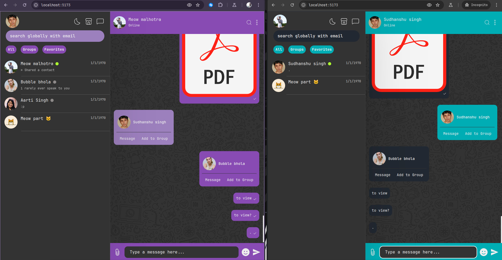
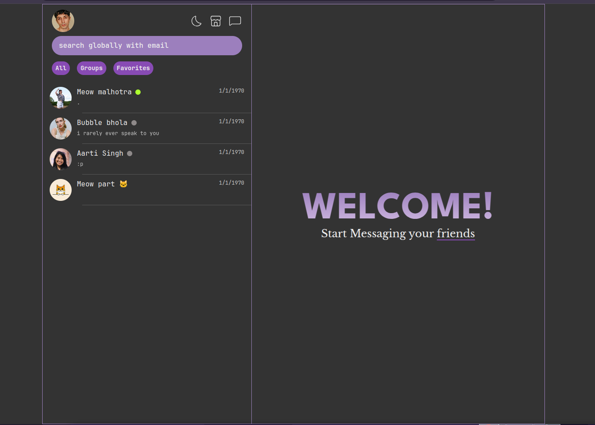

# Chat Application

# Features

<h2>Front Page</h2>

<h2>Live Satus</h2>

https://github.com/user-attachments/assets/3a1eff05-8ace-43ac-b6e6-1b240813c316

<h2>Live Noifications</h2>

https://github.com/user-attachments/assets/321db736-3a01-485e-bf5b-eac150c8136d

<h2>Sharing Media</h2>

https://github.com/user-attachments/assets/0248a672-35d6-42fa-80e9-4b31e5a6bca6
<ul>
  <li>Photos and Videos</li>
  <li>Sharing Contacts</li>
  <li>Schedule Messages</li>
  <li>Pdf files</li>
</ul>
user can view and download these media as well

<h2>Schedule Messages</h2>

https://github.com/user-attachments/assets/145f1d59-b12f-4266-bf94-f62f0a9cb7f1

<h2>Sharing Contacts</h2>

https://github.com/user-attachments/assets/b6da2e12-f487-4c32-a895-d12af672707c

<h2>User thems</h2>
User can pick from different themes

https://github.com/user-attachments/assets/bc3624d4-d1ac-40aa-8443-a3db58ad750d

<h2>Chat Details Section</h2>

https://github.com/user-attachments/assets/6480b664-ce17-4702-b536-4a6c03118d0c
<h2>Delete Messages</h2>

https://github.com/user-attachments/assets/fb89712c-a44c-4038-9117-57c0c051b74e

<h2>Group Creation</h2>

https://github.com/user-attachments/assets/aee07b8e-6d14-4e2d-a5f7-8ff9b5448c69

<h2>Search contacts</h2>

https://github.com/user-attachments/assets/205c60c3-2ba9-49c6-98a4-a19e38fe3106

